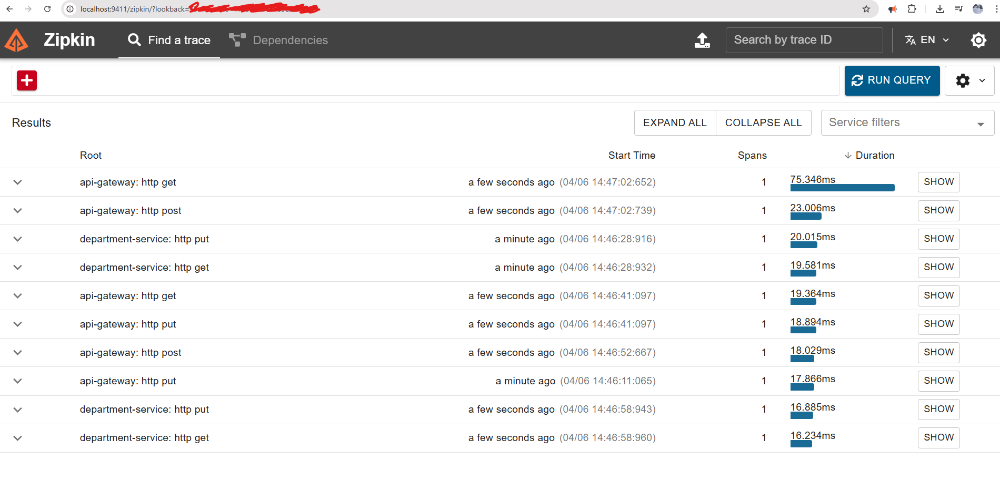

---

### Microservice2: Employee & Department Services

#### **employee-service**

1. Generate `employee-service` project at [start.spring.io](https://start.spring.io/) with dependencies: **Zipkin, Spring Web, Config Client, Eureka Discovery Client**.
2. Rename `application.properties` to `application.yaml` and add required configurations.
3. Create `employee-service.yaml` in the config folder and configure settings.
4. Enable Discovery Client by adding `@EnableDiscoveryClient` in `EmployeeServiceApplication.java`.
5. Create folders: **controller**, **model**, **repository**.
6. Add:
    - `EmployeeController.java` in controller
    - `EmployeeRepository.java` in repository
    - `Employee.java` in model.

#### **department-service**

1. Create repository folder with `DepartmentRepository.java` for CRUD operations.
2. Add `DepartmentController.java` in the controller folder with logger, `@PostMapping`, `@GetMapping`, and `LOGGER` in each method.
3. Test in Postman with a POST request (`id: 2`, `name: CS`) and check Zipkin for queries.
4. Create `EmployeeClient.java` in the client folder.
5. Add **Spring Reactive Web** dependency to `pom.xml` (`spring-boot-starter-webflux`).
6. Create `WebClientConfig.java` in the config package.
7. Verify GET request in Postman: `GET http://localhost:8081/department`.

#### **api-gateway**

1. Generate `api-gateway` project at [start.spring.io](https://start.spring.io/) with dependencies: **Gateway, Spring Boot Actuator, Zipkin, Eureka Discovery Client, Config Client**.
2. Convert `application.properties` to `application.yaml`, and add `ApiGatewayApplication.java` file.
3. In `config-server`, ensure `department-service.yaml` and `employee-service.yaml` are present.
4. Test the endpoint in Postman: `GET http://localhost:8060/department/with-employees`.

--- 

### Screenshots:

